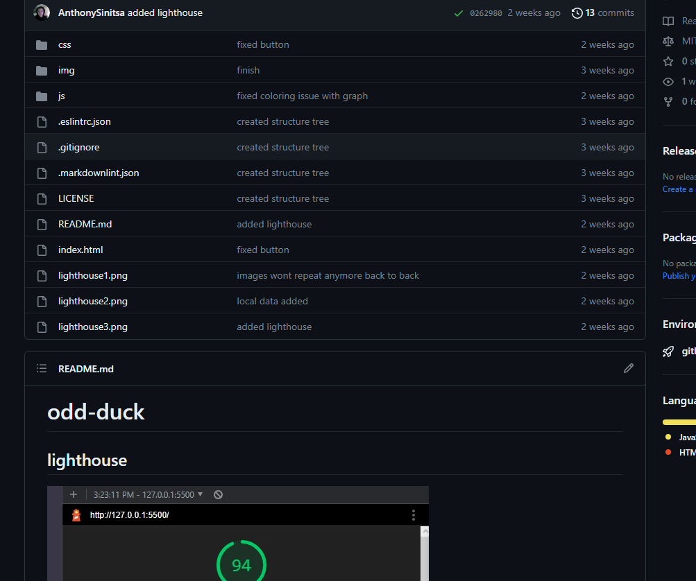
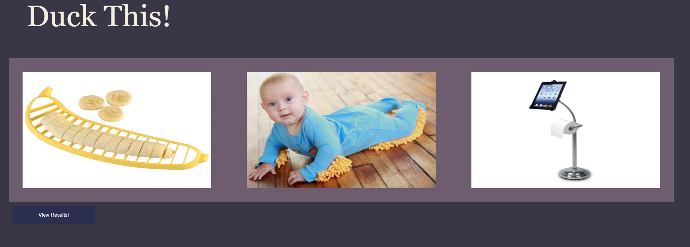
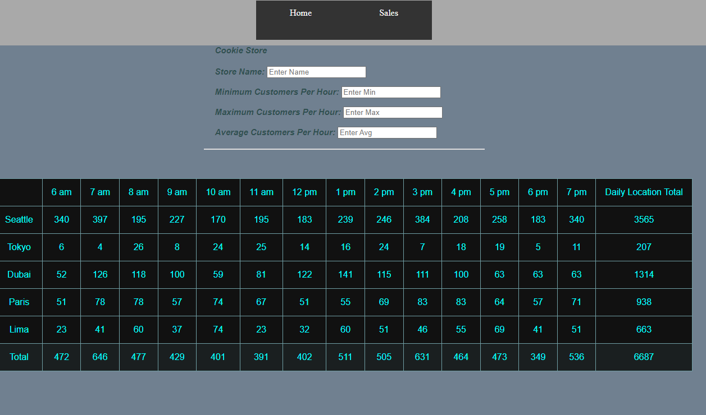
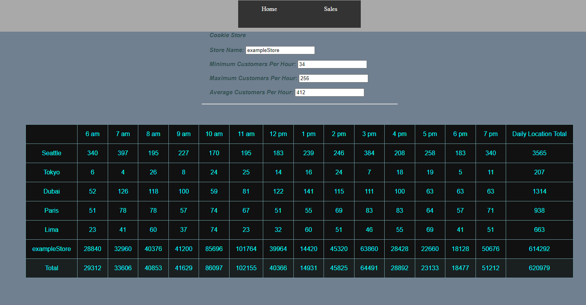

# portfolio-prep

- Creative Technologist
- Building the Future of Digital Art and Design
- Hi, I'm a Creative Technologist with a passion for exploring the intersection of art and technology. I specialize in creating immersive experiences that captivate audiences and leave a lasting impression.
- I love how technology can enhance and transform the way we experience the world around us. From virtual and augmented reality to interactive installations, the possibilities are endless and constantly evolving.

## oddDuck

## cookieStand

